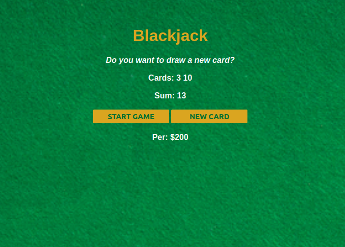

# Black Jack Game
This is a simple but efficient implementation of the famous black Jack game using javascript. The game template is created with html and styling was done using css.

---

## Motivation & Resources

- Building web apps
- Here the <a href="https://scrimba.com/playlist/pkrr5S9">Scrimba Course</a> that guided me while I built this web app.

---

## Contributor
 <a href="https://github.com/tchassijordan">
 tchassi jordan</a>

---

<h3 align="left">Languages and tools:</h3>

    

